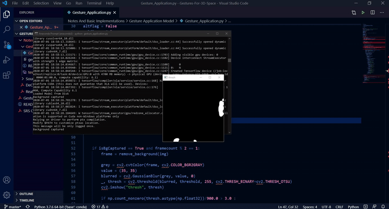

# Gesture Application Model

## Dependencies

* **Python : 3.5+**

* **OpenCV : 4.2.0**

* **PyAutoGUI : 0.9.50**

* **Tensorflow : 2.2.1**

## Working :nerd_face:

<p align="center">
  
</p>

## How to Run ?

* Make sure you have all the pip requirements :
  ```
  pip install -r requirements.txt
  ```

* And then just run the **Gesture_Application.py** and that should do :
  ```
  python gesture_application.py
  ```

## Usage and Functions

* You should analyse the background before starting by pressing **'b'**.
  
  * You can reset the background using **'r'**.

* Gestures Description : 

  * **'Yo'** : **Plays** or **Pauses** the presently running video on the system.
  
  * **'Ok'** : Starts **Volume Control** Options
  
  * **'Stop'** : Toggles **'Alt'** key press in normal conditions but behaves like **'VolumeDown'** when **Volume Control** is on.
  
  * **'Peace'** : Behaves like **'Tab'** when **'Alt'** is pressed and **'VolumeUp'** when **Volume Control** is on.
